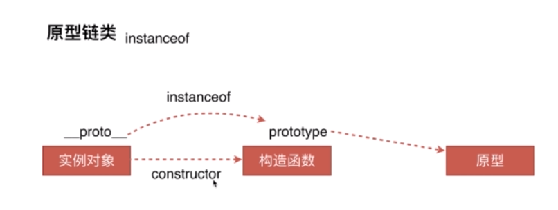
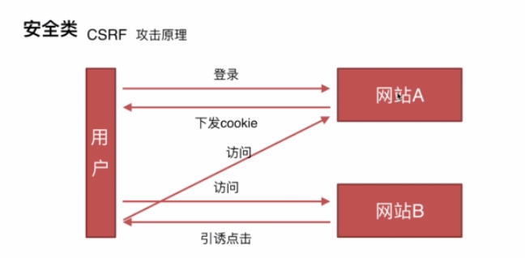
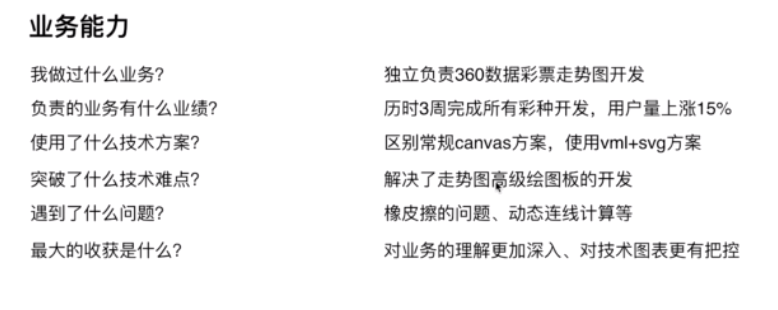

# 面试问题以及面试技巧
### 面试问题
* 固定高度，三栏布局，左边一个div，右边一个，中间自适应
    > 通过浮动实现(脱离文档流，兼容性比较好)
    > 通过定位实现(子元素也脱硫文档流，快捷，方便)
    > flex布局(解决上面两个的缺点，只支持到ie9)
    > table布局(兼容性好，当三个钟一个高度增加时，其它的两个也增加)
    > 网格布局(grid)
    >> 延伸：每个解决方案的优缺点、高度去掉那个还试用、兼容性怎么样
    >> 去掉高度flex和table布局是可以用的
    >> 创建bfc
    **页面布局小结：语义化掌握、页面布局深刻理解、css基础知识、思维灵活积极上进、代码书写规范**
### 面试内容
* css3盒模型
    > margin padding content border ie模型 标准模型
    > 标准模型与ie模型的区别：宽度与高度的不同，css如何设置这两种模型(标准模型指的是content的宽、高，ie的宽高包括padding、border，可以通过box-sizing)
    > js获取盒模型的宽度和高度()
    >> dom.style.width,只能取到内联样式的宽、高
    >> dom.currentStyle.width只有ie浏览器适用
    >> window.getComputedStyle.width兼容谷歌和firefox
    >> dom.getBoudingClientRect()拿到有width,height,left,top
    > 边距重叠
    > BFC(边距重叠解决方案：快捷格式上下文) IFC(内联格式上下文)
    >> display/float/over-flow/position这些属性可以创建BFC
    >> BFC垂直方向的边距会发生重叠，浮动的margin重叠，BFC是单独的元素，计算高度BFC也会计算在内
    >> 消除BFC：给子元素添加一个父元素创建一个BFC设置属性:over-flow:hidden
* DOM事件
    > DOM事件的级别
    >> DOM0 Element.onclick=function(){} //DOM1中没有涉及到与事件相关的操作
    >> DOM2 Element.addEventListenner('click',function(){},false)
    >> DOM3 Element.addEventListenner('keyup',function(){},false) //添加了许多事件
    > 了解DOM事件模型(冒泡、捕获)
    > DOM事件流(事件的捕获，到达目标元素，上升的window对象，渲染到页面)
    >> window->document->html(document.documentElenment)->body(document.body)->……->目标元素
    > EVENT对象的常见应用  
    >> e.preventDefault()
    >> e.stoppropagation()
    >> e.stopImmidiatePropagation()
    >> event.currentTarget
    >> event.target
    > 自定义事件

        var eve = new Event('custom');
        ev.addEventListener('custom',function(){});
        ev.dispatchEvent(eve);//触发事件
* http协议
    > http协议的主要特点
    >> 简单快速(统一UIA)、灵活(可以实现不同数据类型的传输)、无连接(连接一次就会断开)、无状态(不能区分两次连接的客户)
    > http报文的组成部分
    >> 请求报文：请求行(请求类型)、请求头（key：value）、空行(分割请求头和请求体)、请求体
    >> 相应报文：状态行、响应头（key：value）、空行、响应体
    > http方法：get、post、delete、put、head
    > get与post的区别
    >> 在浏览器中回退时，get请求不会再次请求，而post请求会再次发起请求
    >> get请求可以被收藏，浏览器可以主动缓冲，参数也会被保存到浏览器地址栏中，但是post请求不行
    >> get请求传参有长度限制（2kb）过长会被截断，post没有限制
    >> get比post更不安全
    >> get参数放在url中，post放在request.body中
    > 1指示信息；2链接成功；3重定向；4客户端错误；5服务端错误
    >> 301永久重定向，302临时重定向，304表示客户端有缓冲，原来的缓冲还可以用，不需用从服务器重新获取
    >> 400客户端有语法错误，一般是传参有问题；403对请求页面的访问被禁止
    >> 503服务端宕机或者是临时过载，过段时间就好了
    > http协议正常是请求-应答模式，请求时链接，正常返回之后结束，但是采用keep-alive模式之后，链接持久有效（1.1版本支持，0版本不支持）
    > 管线化：将所有请求一次打包然后发起请求，服务端一次把所有请求结果都返回，不是正常的请求一次返回一次；只有get和head请求可以管线化，初次链接不要启动管线化，因为对方的服务器可能不支持管线化；管线化对浏览器的支持不太好
* 原型链
    >创建对象的方式三种
    
        //第一种方式：字面量的方式
        var obj={name:1}
        var obj=new Object({name:1})
        //第二种方式：构造函数的方式
        var fun = function(name){this.name=name};
        obj=new fun();
        //第三种方式：create的方式
        var obj = Object.create({name:1})
    > 原型链的基本原理就是实例化的对象拥有它的构造函数的属性以及构造函数原型的所有方法
    > prototype属性是构造函数的属性
    > \_\_proto\_\_这个属性值是该对象的prototype
    > constructor构造函数可以判断实例的原型
    
    > new运算符
    new运算符的运行过程
    var new = function(func){
        var newObj = {};
        newObj.\_\_proto\_\_=func.prototype;
        var k = func.call(newObj);
        if(k==='Object'){
            return k;
        } else {
            return newObj;
        }
    }
* 继承
    > 类的声明：es6的声明方式
    > 继承方式：借助构造函数实现继承，通过call改变this指针，前两种方式的组合进行继承
    > prototype属性中有construtor属性
    > Object.create创建对象
* 通信类
    > 同源(协议、域名、端口)策略的的定义以及限制：cookie/localStorage/indexDB无法读取；DOM无法获取；ajax请求无法发送
    > 前后端如何通信：ajax,websocket,cors
    > 如何创建ajax:注意兼容性，事件的触发条件，触发顺序
    > 跨域通信的几种方式：jsonp,hash,postMessage,websocket,cors
    >> jsonp跨域是通过script标签的异步加载实现的(只支持get请求)

        function resolveJson(){
            console.log(res)
        }
        var jsonScript = document.createElement("script");
        jsonScript.src='http://hao123.com?callbackName=resolveJson';
        jsonScript.type='text/javascript';
        document.getElementByTagName('head')[0].appendChild(jsonScript);
        客户端代码：resolveJson({name: 'qiutc'});
    >> hash通过iframe嵌入一个新页面:首先获取到iframe标签然后给src属性添加'#'+data(需要传递的数据)
    >> hash的变化页面不刷新所以可以做跨域通信，search改变页面会刷新
    >> cors是可以跨域的ajax请求（fetch支持ie8以上）
    >>> Fetch 请求默认是不带 cookie 的，需要设置 fetch(url, {credentials: 'include'})
    >>> 服务器返回 400，500 错误码时并不会 reject，只有网络错误这些导致请求不能完成时，fetch 才会被 reject。
    >> [fetch请求扩展阅读](https://segmentfault.com/a/1190000006095018)
    >> [跨域扩展阅读](http://www.jianshu.com/p/fca0facfe381)
* 安全类型(CSRF/XSS)
    > CSRF共计原理和防御措施
    >> 跨站请求伪造
    
### 二面主要内容
* **渲染机制、js运行机制、页面性能、错误监控**
* 渲染机制
    > 什么DOCTYPE及作用
    >> 声明文档类型以及DTD规范，告诉浏览器以何种方式来进行解析
    >> DOCTYPE类型：<!DOCTYPE html>/html4有两种模式，严格模式（不包括弃用的和不推荐使用的元素）和传统模式（与严格模式相反）
    > 浏览器渲染过程
    
    > 重排reflow
    >> 当增加、删除DOM节点会导致Reflow或者Repaint
    >> 当移动DOM的位置
    >> 当修改css样式的时候
    >> 当Resize窗口的时候可能会触发
    >> 当修改网页的默认字体，一般不采用这样做，会有性能问题
    > 重绘
    >> DOM改动、css改动
    >> 如何减少Repaint，尽量减少DOM的操作次数：改变多个节点的额时候，可以先都改变了，然后一次性进行渲染
    > 浏览器的绘制方式
* js运行机制
    > 如何理解js的单线程
    > 什么是任务队列
    > 什么Event Loop（当同步事件执行完之后）
    > 异步任务：setTimeout/setInterval/DOM事件/es6的Promise/ajax
* 提升页面性能
    > 资源压缩合并，减少http请求
    > 非核心代码的异步加载->异步加载的方式有哪些->异步加载的区别
    >> 异步加载的方式
    >>> 动态脚本加载：利用js动态加载script文件或者图片文件
    >>> defer：在html解析完成之后执行，如果是多个，按照加载的顺序依次执行
    >>> async：是在加载完成之后立即执行，如果是多个，执行顺序和加载顺序无关
    >>> 执行结果都是同步js文件之后
    > 利用浏览器缓冲->缓冲的分类->缓冲的原理
    >> 缓冲的分类
    >>> 强缓冲：

        Expires:Th,21 Jan 2017 23:39:02 GMT绝对时间;  以客户端为标准
        Cache-Contro Cache-Control:max-age=3600  //相对时间，相对于客户端本地时间3600s之内浏览器不会再向服务器请求这个资源
    >>> 协商缓冲：浏览器向服务器请求该内容是否可以缓冲

    > 使用CDN：cdn加载非常快（尤其是首次打开页面的时候）
    > 与解析DNS

        <meta http='x-dns-prefetch-control' content='on'>   //如何页面是https协议很多浏览器默认是关闭预解析功能，使用这句meta标签就可以打开预解析功能
        <link rel='dns-prefetch' href='//host_name_to_prefetch.com'>  //某些高级浏览器a标签默认打开预解析功能
* 错误监控（产品上线，产生的错误自动收集）
    > 前端错误的分类
    >> 即时运行错误
    >> 资源加载错误:不会冒泡，所以window.onerror无法捕获这种错误
    > 错误的捕获方式
    >> try...catch
    >> window.onerror
    >> object.onerror
    >> performance.getEntries()     //高级浏览器获取到的是一个资源数组
    >> error事件捕获，通过addEventListener添加error事件时，设置为false  
    
    > 上报错误的基本原理
    >> 利用image对象上报
    (new image()).src='http://baidu.com/sda?aa=5&bb'
### 三面和四面
* 准备充分：项目背后的技术以及难点，项目的亮点
* 描述要演练
* 引导找时机 
* 优势要发挥
* 回答要灵活
* 业务能力
* 团队写作能力
* 事务推动能力
* 带人能力
* 遇到什么问题
* 最大的收获是什么

    

   
